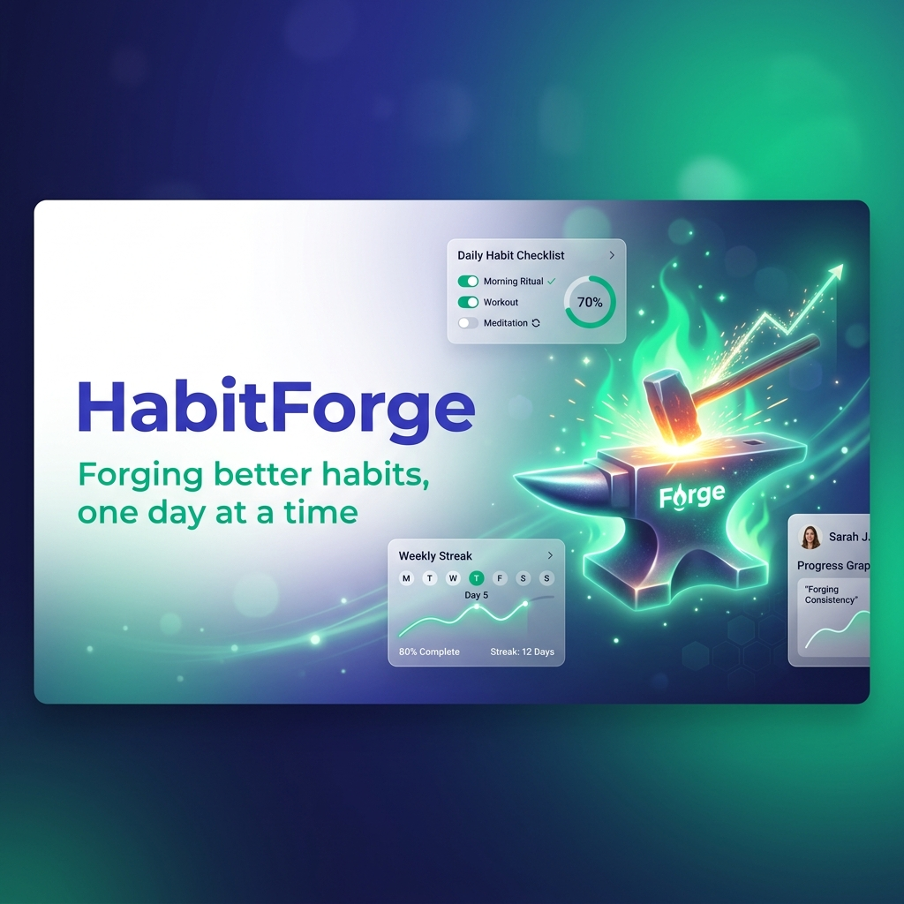
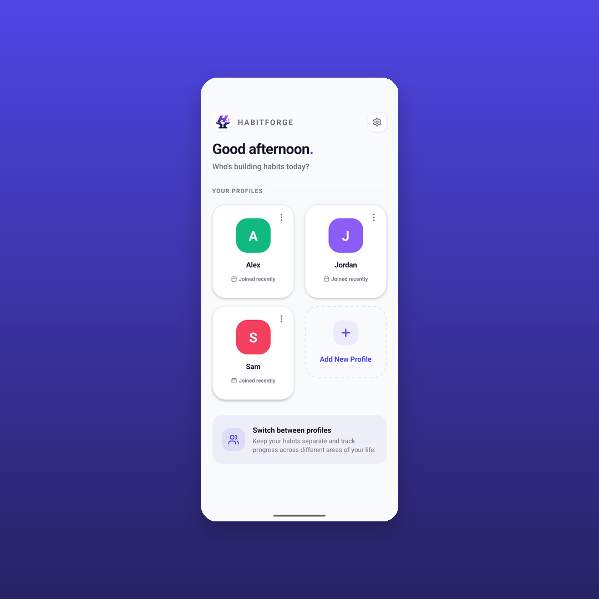
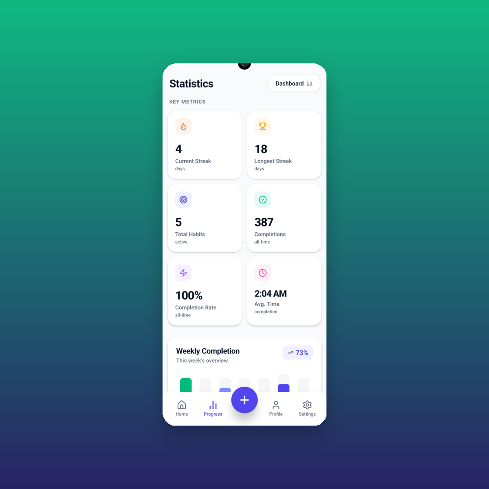

<div align="center">
  

  <br />
  <br />

  **Forging better habits, one day at a time.** <br />
  A premium, offline-first, deeply analytical habit tracking application built with React Native.

  <br />

  [](https://reactnative.dev/)
  [](https://www.sqlite.org/index.html)
  [](https://docs.swmansion.com/react-native-reanimated/)
  [](https://www.typescriptlang.org/)

  <br />
</div>

## 🔥 Why HabitForge?

Most habit trackers are either too simple, losing your interest after a week, or too complex, feeling like a chore to update. **HabitForge** strikes the perfect balance. It combines a gorgeous, fluid, glassmorphic UI with incredibly deep, local-first SQLite analytics that actually teach you about your behavior.

No subscriptions. No cloud syncing delays. Just you and the forge.

---

## ✨ Features

<table>
  <tr>
    <td width="50%">
      
    </td>
    <td width="50%" valign="center">
      <h3>Fluid, Premium UI</h3>
      <p>Every interaction is carefully crafted using React Native Reanimated. From the spring-physics <strong>completion rings</strong> to the deeply satisfying gradient buttons and subtle glassmorphic shadows, the app is designed to wow.</p>
      <ul>
        <li>Animated Completion Rings</li>
        <li>Smooth MotiView Entrances</li>
        <li>Subtle Glass Shadows</li>
        <li>Haptic Feedback on Interactions</li>
      </ul>
    </td>
  </tr>
  <tr>
    <td width="50%" valign="center">
      <h3>Deep, Actionable Analytics</h3>
      <p>The Statistics Dashboard crunches your SQLite data locally to give you real insights without sending your data to the cloud.</p>
      <ul>
        <li><strong>Average Completion Time</strong>: See exactly when you usually complete habits (e.g., 9:30 AM).</li>
        <li><strong>GitHub-style Heatmaps</strong>: Visualize your consistency over the last 90 days.</li>
        <li><strong>Category Distribution</strong>: Stacked bar charts of your habit domains.</li>
        <li>Current & Longest Streaks</li>
      </ul>
    </td>
    <td width="50%">
      
    </td>
  </tr>
</table>

## 🛠️ Tech Stack & Architecture

HabitForge is built for performance and maintainability.

- **Frontend**: React Native (Bare Workflow)
- **Language**: TypeScript (Strict Mode)
- **State Management**: Zustand (blazing fast, boilerplate-free)
- **Local Database**: `react-native-sqlite-storage` (Full 3NF Normalized Schema)
- **Animations**: `react-native-reanimated` v3 & `moti`
- **Icons**: `lucide-react-native`
- **Styling**: Context-aware dynamic theming (Dark/Light mode support)

### Database Schema (3NF)
We use a strictly normalized SQLite database:
1. `profiles`: Support for multi-user/family usage.
2. `categories`: Seeded domains (Health, Finance, etc.).
3. `habits`: Core habit definitions.
4. `habit_days`: Resolves 1NF violations for weekly habit schedules.
5. `completions`: The raw log driving the powerful analytics engine.

---

## 🎨 Branding & Assets

Check out our [LOGO_GUIDELINES.md](./LOGO_GUIDELINES.md) to learn about the visual identity, typography, and color palette (Indigo, Emerald, and Forging Orange) that give HabitForge its premium startup feel. 

Visual assets (App Icons, Splash Screens, Banners) can be found in `src/assets/`.

---

## 🚀 Getting Started

### Prerequisites
- Node.js (v18+)
- Ruby (for iOS CocoaPods)
- Android Studio & Xcode

### Installation

1. **Clone the repository**
   ```bash
   git clone https://github.com/Monaswi0104/HabitForge.git
   cd HabitForge
   ```

2. **Install dependencies**
   ```bash
   npm install
   ```

3. **Install iOS Pods** (Mac only)
   ```bash
   cd ios && pod install && cd ..
   ```

4. **Run the app**
   ```bash
   # For iOS
   npm run ios
   
   # For Android
   npm run android
   ```

---

<div align="center">
  <p>Built with ❤️ and ☕️. Strike the iron while it's hot.</p>
</div>
