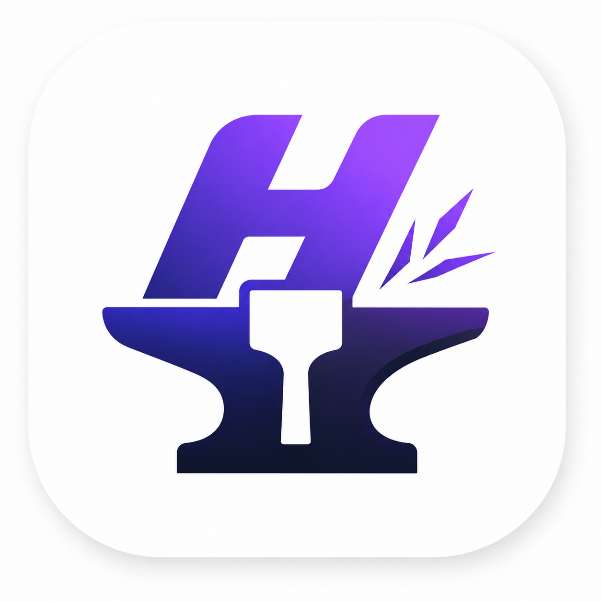

<div align="center">
  
  <h1>HabitForge 🚀</h1>
  <p><b>Level Up Your Life, One Habit at a Time.</b></p>
  
  
  
  
  
  
</div>

<br/>

> **Note**: This is a **Portfolio Project** built to demonstrate expertise in modern React Native development, offline-first architecture, local databases, and complex state management. It is not currently published on the App Store or Google Play.

---

## 📖 About The App

**HabitForge** is a beautiful, fully offline React Native application designed to help you build positive habits and break bad ones. Built with a focus on speed, privacy, and gamification, HabitForge stores everything locally on your device—no cloud subscriptions, no internet required. 

Whether you're sharing an iPad with your family or tracking personal goals on your phone, HabitForge's unique **Multi-Profile System** with secure PIN locks ensures that everyone's progress remains completely private and individualized.

## 📱 Screenshots

|  |  |  |  |
|:---:|:---:|:---:|:---:|
| **Profile Select** | **Home Screen** | **Progress Screen** | **Profile Screen** |

<br/>

|  |
|:---:|
| **Settings Screen** |

---

## ✨ Key Features

- 👥 **Multi-Profile Support**: Create unlimited profiles on a single device. Secure your profile with a 4-digit PIN!
- 📊 **Dynamic Heatmaps**: Visually track your daily completion progress through beautiful, GitHub-style activity heatmaps.
- 🔔 **Smart Local Notifications**: Powered by Notifee, native OS alarms ensure you never miss a habit. Get reliable high-priority banners even when the app is minimized or killed.
- 🎮 **Gamification & XP System**: Earn experience points (XP) for completing habits. Level up your character and earn achievement badges like *Early Bird*, *Consistent*, and *Achiever*!
- 📱 **Offline-First Storage**: 100% of your data is securely stored locally using robust SQLite. Fast, private, and independent of network connections.
- 🎨 **Beautiful UI & Micro-Animations**: A highly polished interface with a buttery smooth dark/light mode toggle, animated transitions, and confetti celebrations powered by Reanimated.
- 🛠 **Bulk Actions**: A smooth multi-select mode in the 'All Habits' screen allows you to complete or delete multiple habits simultaneously.

---

## 🏗 System Architecture

HabitForge follows a modular, decoupled architecture that separates UI logic from data persistence and background tasks.

### 1. Presentation Layer (UI)
- **React Native & React Navigation**: Handles routing (Stack and Bottom Tabs).
- **Lucide Icons & Reanimated**: Powers the fluid micro-interactions and iconography.
- **Theming Engine**: Dynamic context-free theming built directly into components, allowing instantaneous Light/Dark mode switching without app reloads.

### 2. State Management Layer
- **Zustand**: A fast, unopinionated state manager used to coordinate data between the SQLite database and the UI.
- **Store Slices**: `useHabitStore`, `useProfileStore`, and `useSettingsStore` isolate domain logic and provide optimistic UI updates to ensure 60fps responsiveness.

### 3. Data Persistence Layer (SQLite)
A local, relational SQL database (`react-native-sqlite-storage`) acts as the single source of truth.
- **`profiles` table**: Manages users, colors, and encrypted/hashed PINs.
- **`habits` table**: Defines the core habit logic, frequency (`daily` vs `weekly`), and UI colors.
- **`habit_days` table**: A relational junction table specifying exactly which days of the week a specific habit occurs.
- **`completions` table**: Logs immutable timestamped events whenever a habit is marked as done.

### 4. Background Services Layer
- **Notification Service**: Integrates `@notifee/react-native`. It listens to the `useHabitStore` and asynchronously schedules native Android/iOS background timestamp triggers for future dates based on the user's selected reminder times.

---

## 🛠 Tech Stack

### Core Technologies
- **[React Native](https://reactnative.dev)** (v0.86.0) - Cross-platform mobile framework.
- **[TypeScript](https://www.typescriptlang.org/)** - For type-safe code and robust refactoring.
- **[SQLite](https://github.com/andpor/react-native-sqlite-storage)** - For relational, offline-first data persistence.

### Essential Libraries
- **Navigation**: `@react-navigation/native` & `@react-navigation/bottom-tabs`
- **State**: `zustand`
- **Notifications**: `@notifee/react-native`
- **Animations**: `react-native-reanimated` & `react-native-confetti-cannon`
- **Tactile Feedback**: `react-native-haptic-feedback`
- **Date Parsing**: `date-fns`
- **Icons**: `lucide-react-native`

---

## 🚀 Getting Started

### Prerequisites
Make sure you have completed the [React Native Environment Setup](https://reactnative.dev/docs/set-up-your-environment) for your operating system (Node.js, JDK, Android Studio / Xcode).

### Installation

1. **Clone the repository**:
   ```bash
   git clone https://github.com/Monaswi0104/HabitForge.git
   cd HabitForge
   ```

2. **Install JavaScript dependencies**:
   ```bash
   npm install
   ```

3. **Install iOS Pods (macOS only)**:
   ```bash
   cd ios && pod install && cd ..
   ```

### Running the App

Start the Metro bundler:
```bash
npm start
```

Launch the Android emulator:
```bash
npm run android
```

Launch the iOS simulator:
```bash
npm run ios
```

### Testing with Mock Data

If you want to instantly see the app's charts, gamification features, and heatmaps in action without manually creating weeks of habit data, you can generate an offline mock database:

1. Run the included Node script from your terminal:
   ```bash
   node scripts/seed.cjs
   ```
2. The script will generate a massive `src/database/mockData.json` file.
3. If your app is running in Development mode (`__DEV__`) and you have **0 profiles** (e.g. on a fresh install), the app will seamlessly intercept the launch, parse the JSON file, inject the data natively into SQLite, and instantly present you with 3 fully-loaded test profiles (Alex, Jordan, and Sam) complete with 100 days of randomized completion history!

---

## 👨‍💻 Developer

Built with ❤️ by Monaswi.

Feel free to explore the code, open issues, or submit pull requests!

## 📝 License

This project is open-source and available under the MIT License.
