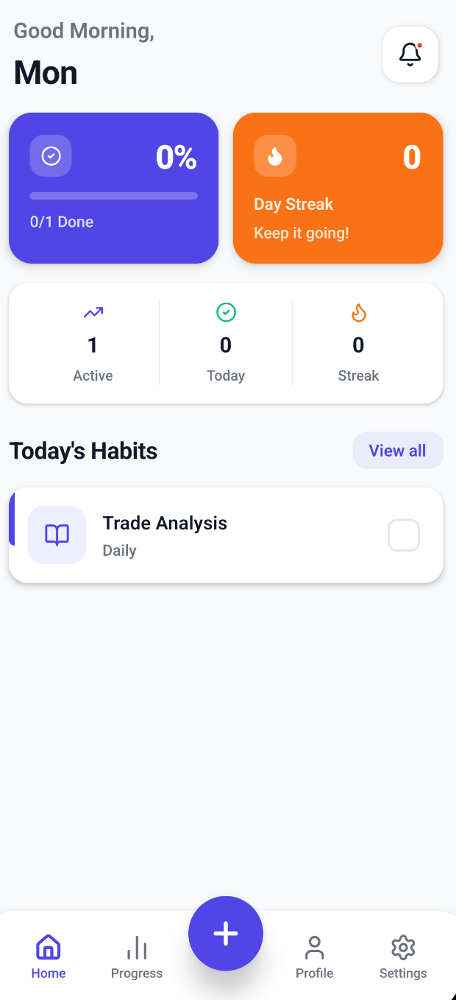
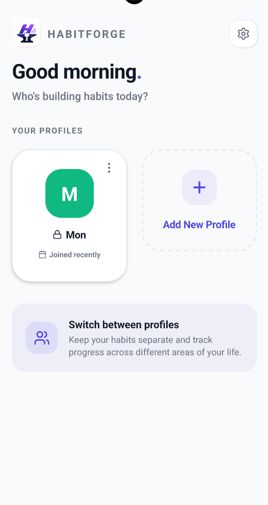
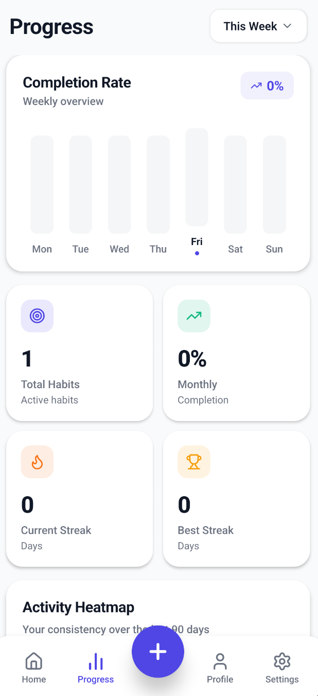
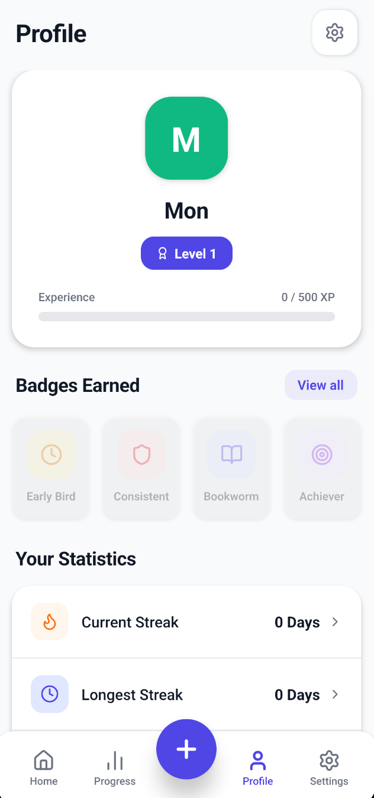
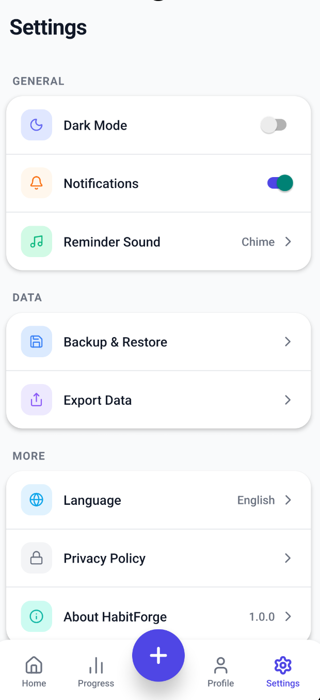

# HabitForge 🚀

HabitForge is a powerful, offline-first React Native application designed to help you build positive habits, track your progress, and level up your life. With a sleek UI and dynamic local notifications, maintaining streaks has never been easier!

## ✨ Features

- **Multi-Profile Support**: Share your device? Create multiple profiles with secure PIN locks so your habits remain private!
- **Dynamic Heatmaps**: Visually track your daily completion progress through beautiful, Github-style activity heatmaps.
- **Smart Notifications**: Built-in native alarms (using `react-native-push-notification`) to ensure you never miss a habit. Get reliable drop-down banners even when the app is minimized.
- **Gamification & XP**: Earn experience points (XP) for completing habits. Level up and earn badges like *Early Bird*, *Consistent*, and *Achiever*!
- **Offline First**: All your data is securely stored locally on your device using robust SQLite storage. No internet required!
- **Beautiful UI**: Polished, modern interface with smooth micro-animations powered by Reanimated.

## 🛠 Tech Stack

- **Framework**: [React Native](https://reactnative.dev) (v0.86.0)
- **State Management**: [Zustand](https://github.com/pmndrs/zustand)
- **Navigation**: [React Navigation](https://reactnavigation.org)
- **Database**: `react-native-sqlite-storage`
- **Animations**: `react-native-reanimated`
- **Notifications**: `react-native-push-notification`
- **Icons**: `lucide-react-native`

## 🚀 Getting Started

### Prerequisites

Make sure you have completed the [React Native Environment Setup](https://reactnative.dev/docs/set-up-your-environment) for your operating system.

### Installation

1. Clone the repository:
   ```bash
   git clone https://github.com/Monaswi0104/HabitForge.git
   cd HabitForge
   ```

2. Install dependencies:
   ```bash
   npm install
   ```

3. Install iOS Pods (macOS only):
   ```bash
   cd ios && pod install && cd ..
   ```

### Running the App

Start the Metro bundler:
```bash
npm start
```

Run on Android:
```bash
npm run android
```

Run on iOS:
```bash
npm run ios
```

## 📱 Screenshots

<div align="center">
  
  
  
  
</div>

<div align="center">
  
</div>

## 🤝 Contributing

Contributions, issues, and feature requests are welcome!

## 📝 License

This project is open-source and available under the MIT License.
