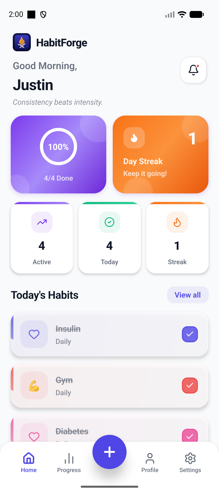
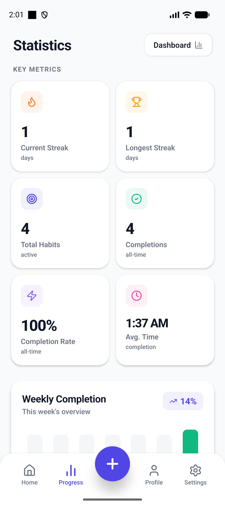
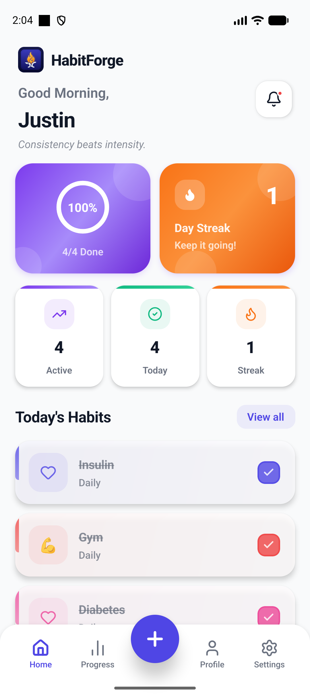
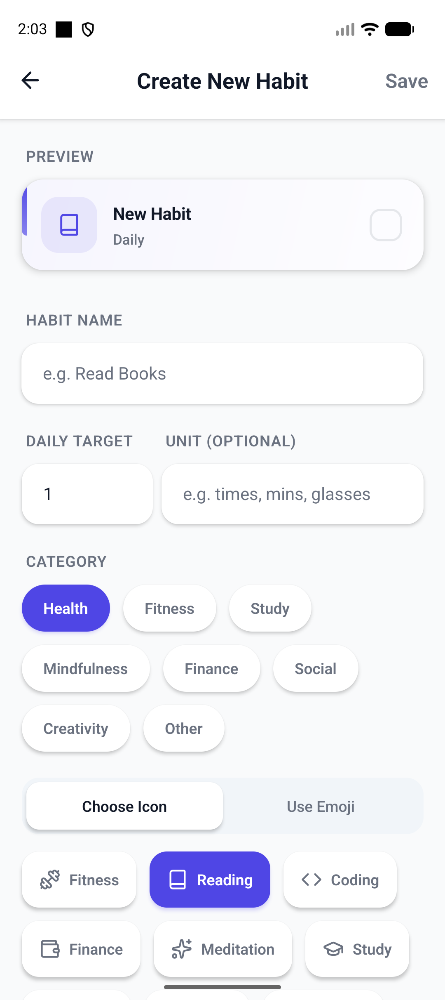
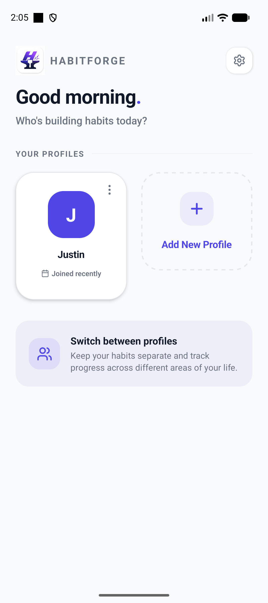
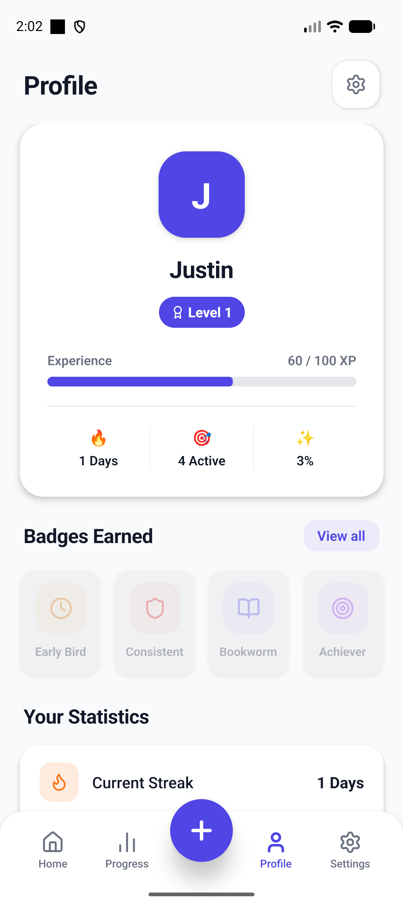
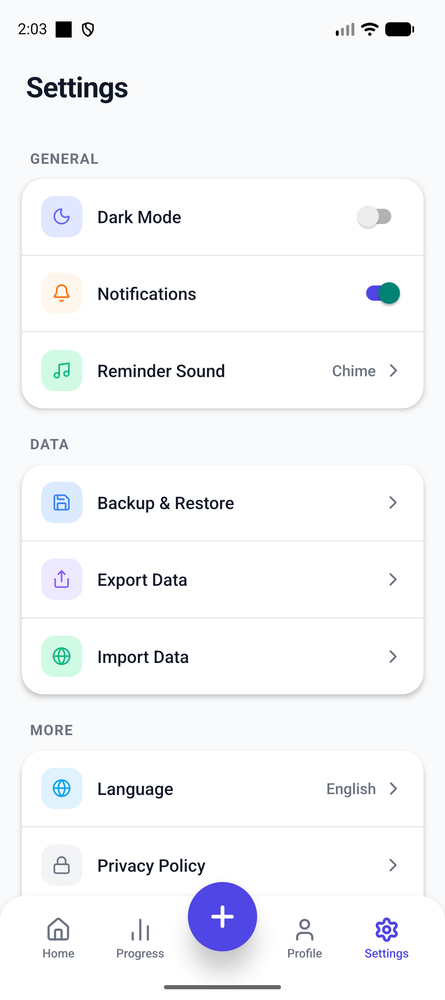

<div align="center">
  

  <br />

  # HabitForge

  **Forging better habits, one day at a time.**

  A premium, offline-first habit tracking app with deep analytics, beautiful animations, and smart reminders — built entirely with React Native.

  <br />

  [](https://reactnative.dev/)
  [](https://www.typescriptlang.org/)
  [](https://www.sqlite.org/index.html)
  [](https://docs.swmansion.com/react-native-reanimated/)

</div>

---

## 🔥 Why HabitForge?

Most habit trackers are either too simple — losing your interest after a week — or too complex, feeling like a chore to update. **HabitForge** strikes the perfect balance: a gorgeous, fluid UI paired with powerful local-first SQLite analytics that actually teach you about your behavior.

No subscriptions. No cloud syncing delays. No ads. Just you and the forge.

---

## 📱 App Screenshots

<div align="center">
  <table>
    <tr>
      <td align="center"><b>Home Screen</b><br></td>
      <td align="center"><b>Progress</b><br></td>
      <td align="center"><b>Habit Details</b><br></td>
      <td align="center"><b>Create Habit</b><br></td>
    </tr>
    <tr>
      <td align="center"><b>Profile Select</b><br></td>
      <td align="center"><b>Profile Stats</b><br></td>
      <td align="center"><b>Settings</b><br></td>
      <td align="center"></td>
    </tr>
  </table>
</div>

---

## ✨ Features

### 🏠 Home Dashboard
- **Animated Progress Ring** — A beautiful SVG ring with spring-physics animation showing your daily completion percentage
- **Streak Tracker** — Gradient cards displaying your current day streak with motivational messages
- **Quick Stats** — Individual elevated stat cards with gradient accent bars for Active habits, Today's completions, and Streak count
- **Smart Reminders** — Tap the notification bell to see all scheduled reminders in a beautiful custom modal
- **Confetti Celebration** — Complete all your habits for the day and get rewarded with a confetti cannon! 🎉

### 📝 Habit Management
- **Create Custom Habits** — Set title, category, frequency (daily/weekly), custom colors, icons or emojis, daily targets with units, and reminder times
- **Multi-step Habits** — Track habits with multiple steps (e.g., "Drink 8 glasses of water") with visual progress bars
- **Flexible Scheduling** — Choose specific days of the week for weekly habits
- **Batch Operations** — Long-press to select multiple habits for bulk deletion
- **Gradient Habit Cards** — Each card has a subtle color-tinted background matching its accent color

### 📊 Progress & Analytics
- **GitHub-style Heatmap** — Visualize your consistency over the last 90 days with an interactive activity grid
- **Completion Trends** — Weekly bar charts showing your habit completion rates over time
- **Category Distribution** — See how your habits break down across categories (Health, Finance, Learning, etc.)
- **Streak Analytics** — Track current streaks, longest streaks, and best performing days of the week
- **Overall Completion Rate** — Percentage-based analytics across all your habits

### 👤 Profile System
- **Multi-Profile Support** — Create multiple profiles for family members or different contexts
- **Avatar Selection** — Choose from a curated set of color avatars
- **Profile Stats** — View per-profile statistics and habit counts

### ⏱ Focus Timer
- **Pomodoro-style Timer** — A dedicated focus timer screen for deep work sessions
- **Animated Circular Progress** — Beautiful countdown ring with real-time updates
- **Session Tracking** — Keep track of your focused work sessions

### ⚙️ Settings & Customization
- **Dark / Light Mode** — Full theme support with carefully designed color palettes for both modes
- **Notification Controls** — Toggle notifications on/off globally
- **Reminder Sound Selection** — Choose from Chime, Bell, Ping, or Buzz sounds
- **Custom Reminder Modals** — Premium-styled modal popups that match the app's UI instead of plain system alerts
- **About Section** — App info and credits

### 🔔 Smart Notifications
- **Scheduled Reminders** — Set per-habit reminder times with native OS notifications via Notifee
- **Recurring Alerts** — Habits you haven't completed will gently nag you every 30 seconds with a premium in-app modal
- **Mark Done from Notification** — Complete habits directly from the reminder popup without navigating

### 🎨 Design & Polish
- **Linear Gradients** — Gradient cards, accent bars, and tinted backgrounds throughout the app
- **Spring Animations** — React Native Reanimated 4 powers buttery smooth transitions and micro-interactions
- **Haptic Feedback** — Subtle vibrations on completions, toggles, and navigation for tactile satisfaction
- **Staggered Entrances** — Habit cards animate in one-by-one with FadeInDown spring animations
- **Decorative Elements** — Frosted glass circles and layered shadows for depth

---

## 🛠️ Tech Stack

| Layer | Technology |
|-------|-----------|
| **Framework** | React Native 0.86 (Bare Workflow) |
| **Language** | TypeScript (Strict Mode) |
| **State Management** | Zustand |
| **Local Database** | `react-native-sqlite-storage` |
| **Animations** | `react-native-reanimated` v4 |
| **Gradients** | `react-native-linear-gradient` |
| **Navigation** | React Navigation 7 (Native Stack + Bottom Tabs) |
| **Notifications** | `@notifee/react-native` |
| **Icons** | `lucide-react-native` |
| **Charts / SVG** | `react-native-svg` |
| **Haptics** | `react-native-haptic-feedback` |
| **Date Utilities** | `date-fns` |

---

## 🗄️ Database Schema (3NF)

HabitForge uses a strictly normalized SQLite database with 5 tables:

```
┌──────────────┐     ┌──────────────┐     ┌──────────────┐
│   profiles   │────▶│    habits     │────▶│ completions  │
│──────────────│     │──────────────│     │──────────────│
│ id (PK)      │     │ id (PK)      │     │ id (PK)      │
│ name         │     │ profile_id   │     │ habit_id     │
│ avatar_color │     │ title        │     │ date         │
│ created_at   │     │ category_id  │     │ progress     │
└──────────────┘     │ frequency    │     │ completed_at │
                     │ color        │     └──────────────┘
┌──────────────┐     │ icon         │
│  categories  │────▶│ target_count │     ┌──────────────┐
│──────────────│     │ target_unit  │     │  habit_days  │
│ id (PK)      │     │ reminder_time│◀────│──────────────│
│ name         │     └──────────────┘     │ habit_id     │
│ icon         │                          │ day          │
└──────────────┘                          └──────────────┘
```

- **profiles** — Multi-user/family support
- **categories** — Seeded domains (Health, Fitness, Finance, Learning, etc.)
- **habits** — Core habit definitions with colors, icons, targets, and reminders
- **habit_days** — Resolves 1NF violations for weekly habit schedules
- **completions** — The raw log driving the analytics engine

---

## 🚀 Getting Started

### Prerequisites
- Node.js (v22+)
- Ruby (for iOS CocoaPods)
- Android Studio & Xcode
- JDK 17+

### Installation

1. **Clone the repository**
   ```bash
   git clone https://github.com/Monaswi0104/HabitForge.git
   cd HabitForge
   ```

2. **Install dependencies**
   ```bash
   npm install
   ```

3. **Install iOS Pods** (Mac only)
   ```bash
   cd ios && pod install && cd ..
   ```

4. **Run the app**
   ```bash
   # Start Metro bundler
   npm start

   # For Android
   npm run android

   # For iOS
   npm run ios
   ```

---

## 📁 Project Structure

```
src/
├── assets/            # Images, icons, and app branding
├── components/        # Reusable UI components
│   ├── habit/         #   HabitCard, HabitList
│   └── profile/       #   ProgressRing, Avatar
├── constants/         # Colors, theme definitions
├── database/          # SQLite schema & initialization
├── navigation/        # React Navigation setup
├── screens/           # All app screens
│   ├── auth/          #   OnboardingScreen
│   ├── HomeScreen     #   Dashboard with cards & habits
│   ├── CreateHabitModal   #   Full habit creation flow
│   ├── HabitDetailScreen  #   Individual habit analytics
│   ├── ProgressScreen     #   Heatmaps, charts, streaks
│   ├── ProfileScreen      #   Multi-profile management
│   ├── FocusTimerScreen   #   Pomodoro-style timer
│   ├── SettingScreen      #   App preferences
│   └── AllHabitsScreen    #   Full habit list with batch ops
├── services/          # Notification scheduling
├── store/             # Zustand state management
├── types/             # TypeScript type definitions
└── utils/             # Helpers (dates, streaks, haptics)
```

---

## 📄 License

This project is for educational and portfolio purposes.

---

<div align="center">
  <p>Built with ❤️ by <strong>Monaswi</strong></p>
  <p><em>Strike the iron while it's hot.</em> 🔨🔥</p>
</div>
